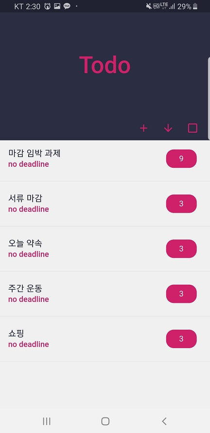
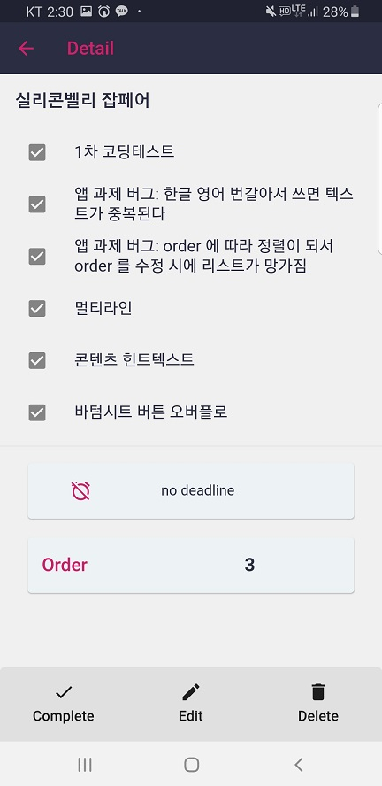

# todo

todo application.

## Requirement:

+ Create TODO[ Title & Contents ] 
+ View TODO List
+ Edit TODO Title and Contents
+ Delete Existed TODO
+ Set Priority Order about TODO ( + and Ordering Greater, Less )
+ Check out completed TODO 
+ Set DeadLine about TODO and Notify reach to DeadLine

## Sample Image:

#### 1. Home Page

#### 2. Edit Page

## Getting Started

This project is a starting point for a Flutter application.

A few resources to get you started if this is your first Flutter project:

- [Lab: Write your first Flutter app](https://flutter.dev/docs/get-started/codelab)
- [Cookbook: Useful Flutter samples](https://flutter.dev/docs/cookbook)

For help getting started with Flutter, view our
[online documentation](https://flutter.dev/docs), which offers tutorials,
samples, guidance on mobile development, and a full API reference.
